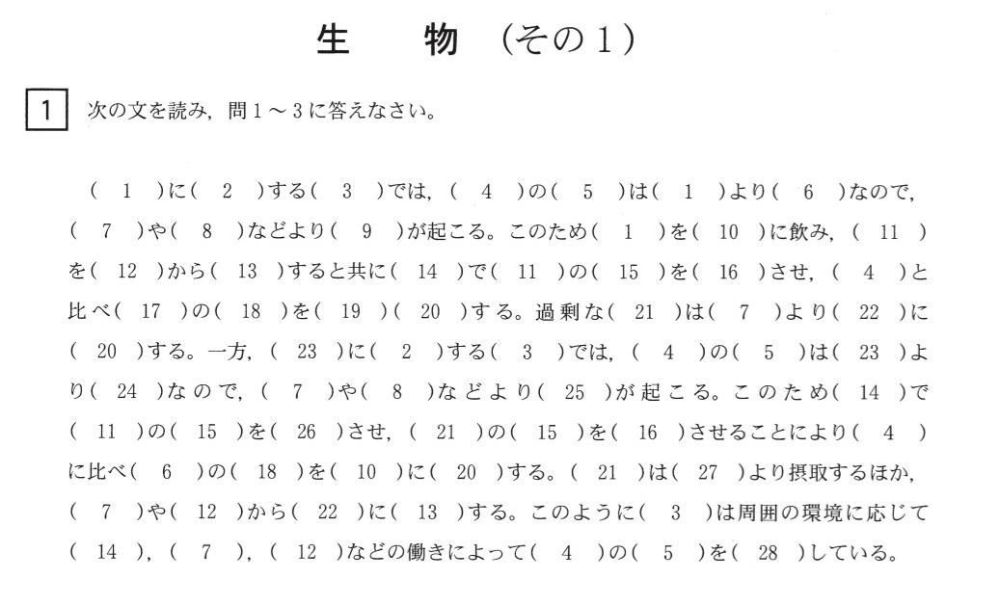

シンプルさについて語るときに僕の語ること、というテーマでいくつかの記事を書きました。

- UNIX哲学に学ぶシンプル
- Less is More
- 状態 > 結合 > 複雑性 > コード量
- アプリケーションコードをシンプルに
- **N対Nより1対1**
- 共通化の条件

今回はN対Nの対応関係を合わせる作業は人のすべき作業ではない、という話です。

## N:Nより1:1

プログラミング言語も日々進化を続けていて、より多くの言語で採用されている仕様・機能はそれだけ開発者からの支持されているとみることが出来ます。

例えばPythonが静的型付け言語としての機能を獲得し、型付けして開発するのが当たり前になってきています。
またRustの所有権というアイディアはSwiftにも取り込まれました。
これらのプログラミング言語の進化からプログラマーが必要としている仕様・機能について知ることが出来ると考えています。

そして本題の「N:Nより1:1」は何について触れたいのかというと、キーワード引数です。
ちょっと地味なテーマですね。

RubyやPython、そして比較的新しいSwift, Kotlinといったプログラミング言語で使える機能です。

キーワード引数とは関数やメソッドに引数を渡す場合に、キーワードと値を1:1で渡す機能です。
キーワード引数の機能がない場合は引数の順序と意味を宣言元のコードを読んでよく確認する必要がありますが、
キーワード引数では引数の意味と渡す値を1:1で対応させるためミスが起きにくいです。

ちなみにPythonコミュニティーではキーワード引数の利用はオプションですが、Swiftではキーワード有りで呼び出す方法がデフォルトです。
一応Swiftでもキーワードを宣言せずに呼び出せる関数も作れます。

### JavaコミュニティーによるN:Nを避ける工夫

Javaにはキーワード引数のような機能はありませんが、呼び出し元と呼び出し先で順序を間違えるリスクはもちろん致命的であると認識されています。
そのためコンストラクタに3つ以上の引数を渡す場合は、`Builder`パターンという方法によってN:Nではなく1:1の記述によって
順序によるミスを防いでいます。

#### `Builder`パターンを使わないケース

#### `Builder`パターンを使うケース

### JS/TSコミュニティーによるN:Nを避ける工夫

JavaScript, TypeScriptにはキーワード引数がありませんが、
Javaとは違いJavaScriptは構造体（オブジェクト）の取り扱いが大変簡単であるため、
複数の引数を必要とする場合は1つのオブジェクトに値を格納して渡すことでN:Nを避けることが出来ます。

### SQLに感じるN:Nの課題

RDBにおいてカラムの数が10を超えることは異常なことではありません。
そしてSQL直書きで`INSERT`や`UPDATE`といった文を使用する場合は、
カラム名と値の列挙順序を別々の場所で合わせるというミスを生みやすい作業を強いられることになります。
私はカラムの数が多いほど、そのN:Nを合わせる作業は人が注意を払ってやるべき作業だとは思えず、
コンピューターに任せるべき作業だと感じます。

そして、この状況を改善したいOSSコミュニティーの情熱は
SQLの書き味を向上させるためのエディターなどの改良ではなく、
SQLを直接書かないORM[^1]の開発に向けられています。

[^1]: Object-Relational Mapping

ORMなどのソリューションはまだ未成熟な点やデメリットはあるものの、
多くの人がこれらのソリューションと直書きのSQLを併用しているようです。

- [SQL直書き派ですが、フレームワーク全盛でSQL直書きしている人は少数ですか？ORマッパーはブラックボックス的で
  チューニングとか色々と行き詰まらないかなと思ってしまう。][SQL直書き派ですがURL]への回答
- [ベテランエンジニアは、実行されるSQLがブラックボックスという理由で
  ORマッパーは使わない人が多いですか？][ベテランエンジニアはURL]への回答

ORMはN:Nの記述の解消だけではなく、型安全にクエリーを組み立てられる、テーブル名やカラム名の補完が効くといった
より多くの問題を解決しようとしています。これらのサポートにより快適にクエリーを書くことが出来ます。

TS/JSのORMは[Prisma](https://www.prisma.io/)が有名ですね。
こちらはSQLを意識しないTS/JSらしいインターフェースです。
実績のあるORMなのでパフォーマンス上の課題が発生しなければ生成されているSQLを推測しようとする必要はないでしょう。

[続いてこちらのデモを２〜３回ご覧ください](https://koskimas.github.io/kysely/index.html)

Kyselyはかなり新しいライブラリーですが、型情報を駆使したサジェストの選択でどんどんクエリーをタイプセーフに組み立てることができます。
うっかりキーボードを触って文字列を編集してもクエリーをとして成り立たない場合にエディター上でエラーを教えてくれます。
SQLがイメージしやすいので、
SQLがイメージできないと落ち着かないけどミスなくストレスフリーでコードを書きたい、
という人にはおすすめだと思います（まだbetaですが）。

私はKyselyにAltSQL的な立ち位置の品質の高いライブラリーとして一定の地位を確立してくれないかと期待しています。
理由は直SQL派の人もKyselyなら受け入れてもらえるだろうという希望があるからです。
いつでもPRできるようにcloneは済ませました(ｷﾘ

## まとめ

私のSQLとの付き合い方は、今のところ次のような方針がよい塩梅かなと思っています。

- 集計処理、トランザクションなど、安全性やパフォーマンスに特別の注意を払いたい処理はSQLを直書きする
- シンプルなINSERT、UPDATEなどのクエリーはORMが生成するクエリーを確認してORMを使う

私はSQLが書き味も可読性においても他の言語より劣っていると考えているのでORMを使って効率を上げるべきだと思います。
離れた場所でN:Nの確認作業が発生するたびにため息をついています。

他のモダンな言語とは異なりエディターがミスを教えてくれないので、集中したいロジック以外のことを気にする必要があります。
つまり頭の中をシンプルに保つことが出来ません。

ロジックに集中できることが良い言語の１つの要素だと思います。
そしてロジックに集中できるよう、つまらないミスを教えてくれるエディターの優れたサポートが用意されているかどうか、
という点も含めて言語を評価する際に考慮すべきことだと思います。

RDBという技術はこれからもずっと使われていくと思いますが、クエリー言語やそのための環境がもっと進化してくれることに期待しています。

[SQL直書き派ですがURL]: https://jp.quora.com/SQL%E7%9B%B4%E6%9B%B8%E3%81%8D%E6%B4%BE%E3%81%A7%E3%81%99%E3%81%8C-%E3%83%95%E3%83%AC%E3%83%BC%E3%83%A0%E3%83%AF%E3%83%BC%E3%82%AF%E5%85%A8%E7%9B%9B%E3%81%A7SQL%E7%9B%B4%E6%9B%B8%E3%81%8D%E3%81%97%E3%81%A6%E3%81%84
[ベテランエンジニアはURL]: https://jp.quora.com/%E3%83%99%E3%83%86%E3%83%A9%E3%83%B3%E3%82%A8%E3%83%B3%E3%82%B8%E3%83%8B%E3%82%A2%E3%81%AF-%E5%AE%9F%E8%A1%8C%E3%81%95%E3%82%8C%E3%82%8BSQL%E3%81%8C%E3%83%96%E3%83%A9%E3%83%83%E3%82%AF%E3%83%9C%E3%83%83%E3%82%AF
